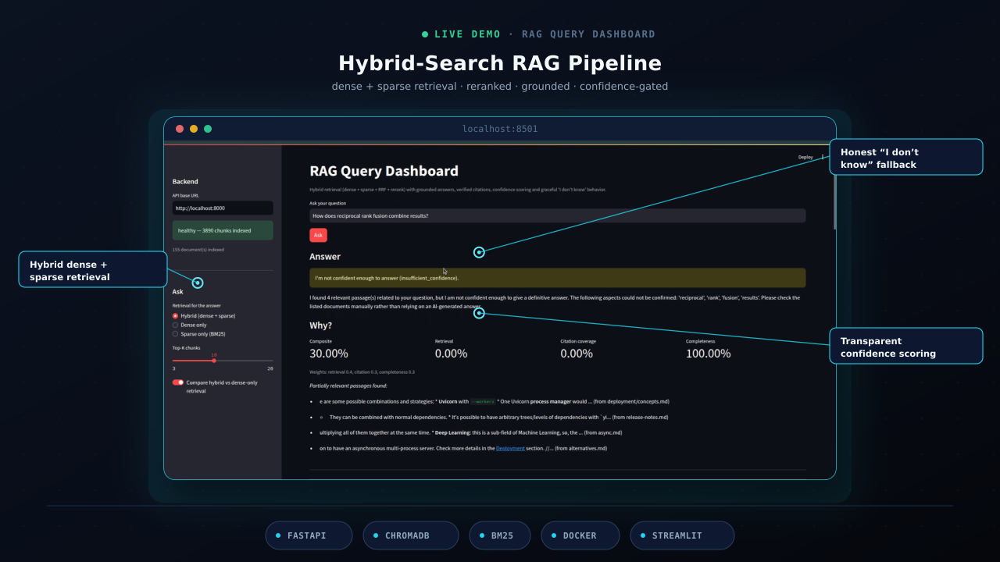
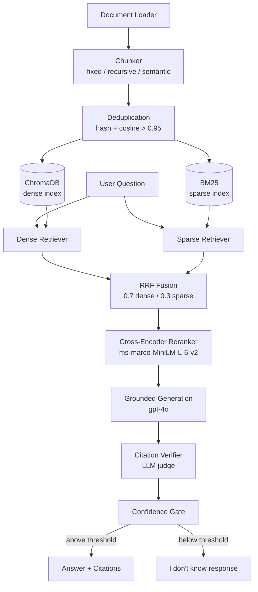
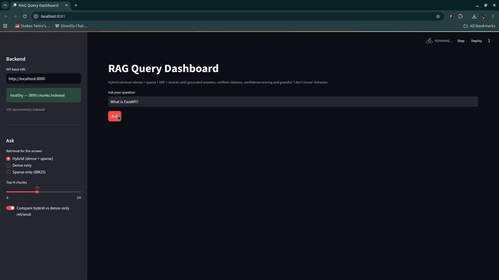

<div align="center">

# 🔍 Hybrid-Search RAG Pipeline

**A production-oriented retrieval-augmented generation pipeline over internal documentation with automated evaluation — catch retrieval and generation regressions before they ship.**


[Why](#-why-this-project-exists) • [Features](#-features) • [Architecture](#-architecture) • [Quickstart](#-quickstart) • [API](#-api) • [Evaluation](#-evaluation-results) • [Structure](#-project-structure) • [Testing](#-testing) • [Design Decisions](#-design-decisions) • [Golden Dataset](#-golden-dataset-contribution-rules) • [Limitations](#-known-limitations--tuning-opportunities) • [Config](#-configuration)

</div>

---

## 🧐 Why This Project Exists

Most RAG systems are judged by vibes — "seems good in the demo." There is no automated way to know whether a chunking tweak, a prompt rewording, or a retrieval change quietly tanked answer quality.

This project treats the RAG pipeline like source code: benchmarked against a fixed golden bar, diffed across chunking strategies, and swappable under a typed interface. The evaluation harness is fully decoupled from the pipeline through adapter functions, so any retrieval + generation stack that satisfies the contract can be dropped in with zero harness changes.

---

## ✨ Features

| | Feature | Description |
|---|---|---|
| 🔀 | **Hybrid Retrieval** | Dense ChromaDB cosine similarity + BM25 sparse search fused with Reciprocal Rank Fusion (dense weight 0.7 / sparse 0.3), then cross-encoder reranking (cross-encoder/ms-marco-MiniLM-L-6-v2) into one ranked list. |
| 📎 | **Grounded Generation** | System-prompt-grounded answers with mandatory inline `[N]` citations pointing at retrieved chunks. The LLM is instructed to never make a factual claim without a citation. |
| ✅ | **Citation Verification** | An LLM judge checks each `[N]` citation against the retrieved chunk and returns `SUPPORTED` or `UNSUPPORTED` per claim. Citation accuracy is a real measured metric, not a constant. |
| 🚦 | **Confidence Gating** | Composite score across retrieval quality, citation coverage, and answer completeness. Below `RAG_CONFIDENCE_THRESHOLD` the system returns a structured "I don't know" response instead of hallucinating. |
| ✂️ | **Three Chunking Strategies** | Fixed-size with overlap (baseline), recursive by section headers (structure-aware), semantic by topic boundaries (embedding-similarity). All three are switchable per ingest and benchmarked head-to-head. |
| 🧹 | **Deduplication** | Hash + embedding-similarity checks (cosine > 0.95) before inserting any chunk. Re-seeding is idempotent — already-indexed chunks are skipped automatically. |
| 📊 | **Evaluation Harness** | 52-question golden dataset covering four question types (lookup, multi-hop, no-answer, ambiguous). Four automated metrics judged by GPT-4o-mini. Chunking strategy comparison runner with progress logging. Exit code is the contract for CI. |
| 🌐 | **API Endpoints** | Full FastAPI service — ask, retrieve, ingest, list documents, health check, reset — with auto OpenAPI docs at `/docs`. |
| 📈 | **Streamlit Dashboard** | Ask questions and see: generated answer with clickable `[N]` citations, retrieved chunks ranked by relevance, confidence scores broken down by dimension, toggle to compare hybrid vs dense-only retrieval side by side. |
| 🔌 | **Fully Offline Without LLM** | Mock embeddings + mock judge keep the entire pipeline testable in CI with zero API spend. Real embeddings + real judges activate with one environment variable. |

<div align="center">



*Streamlit dashboard — answer, citations, confidence breakdown, and hybrid vs. dense-only comparison.*

</div>

---

## 🏗️ Architecture



---

## 🎬 Demo

<div align="center">



📺 **[Watch the full walkthrough video](https://drive.google.com/PLACEHOLDER_LINK)**

</div>

---

## 🚀 Quickstart

### Docker (recommended)

```bash
git clone https://github.com/mohammadyakub-ai/rag-pipeline-hybrid-search.git
cd rag-pipeline-hybrid-search
cp .env.example .env          # add OPENROUTER_API_KEY
docker compose up --build
```

The `seed` service indexes 155 docs automatically once the API is healthy.

| Service | URL |
|---|---|
| API | http://localhost:8000 (`/docs` for OpenAPI) |
| Dashboard | http://localhost:8501 |
| ChromaDB debug | http://localhost:8001 |

### Local development

```bash
python -m venv .venv
source .venv/bin/activate
pip install -r requirements.txt
cp .env.example .env          # add OPENROUTER_API_KEY

# index the corpus
uvicorn rag_pipeline.api:create_app --factory --app-dir src &
python3 scripts/seed.py --reset

# dashboard
streamlit run dashboards/query_dashboard.py
```

### Re-seed (idempotent)

```bash
python3 scripts/seed.py --reset
```

> **Dependencies:** `requirements.txt` pins no exact versions (`chromadb>=1.0.0`, `openai>=1.0.0`, `openrouter>=1.1.136`, `sentence-transformers>=2.7.0`, etc.). Evaluation results above were produced with: `fastapi 0.137.2`, `chromadb 1.5.9`, `sentence-transformers 6.0.1`, `openai 3.6.0`, `openrouter 1.1.136`, `uvicorn 0.49.0`, `streamlit 1.37.0`, `pydantic 2.12.5`.

---

## 🌐 API

| Method | Path | Description |
|---|---|---|
| `POST` | `/v1/ask` | Full pipeline — answer + citations + confidence |
| `POST` | `/v1/retrieve` | Retrieval only, no LLM needed |
| `POST` | `/v1/ingest` | Upload a document (`.pdf` `.md` `.txt` `.html`) |
| `GET` | `/v1/documents` | List indexed documents with chunk counts |
| `GET` | `/healthz` | Liveness + `vector_chunks` + `bm25_chunks` counts |
| `POST` | `/v1/reset` | Wipe the index (used by `seed --reset`) |
| `GET` | `/docs` | Auto-generated OpenAPI docs |

### Example

**Request**

```bash
curl -X POST http://localhost:8000/v1/ask \
  -H "Content-Type: application/json" \
  -d '{"question": "How does reciprocal rank fusion combine results?", "top_k": 5}'
```

**Response**

```json
{
  "can_answer": true,
  "question": "How does reciprocal rank fusion combine results?",
  "answer": "RRF merges the dense and sparse ranked lists by rank position [1]. Each chunk receives a score based on its rank in each list, and the scores are combined [2].",
  "citations": {
    "total": 2, "supported": 2, "unsupported": 0, "accuracy": 1.0,
    "citations": [
      {"citation": "[1]", "supported": true},
      {"citation": "[2]", "supported": true}
    ]
  },
  "confidence": {
    "composite": 0.87,
    "retrieval_confidence": 0.90,
    "citation_coverage": 0.75,
    "completeness": 0.90,
    "weights": {"retrieval": 0.4, "citation": 0.3, "completeness": 0.3}
  },
  "sources": [
    {
      "chunk_id": "abc123",
      "source_file": "tutorial/path-params.md",
      "section": "Path Parameters",
      "rerank_score": 0.43,
      "rrf_score": 0.012,
      "content": "..."
    }
  ]
}
```

---

## 📚 Corpus

| | |
|---|---|
| **Source** | Official [FastAPI documentation](https://github.com/tiangolo/fastapi/tree/master/docs/en/docs) |
| **License** | MIT |
| **Files** | 155 markdown files |
| **Words** | ~164,000 |
| **Chunks** | 3,890 (after fixed-size chunking with deduplication) |
| **Location** | `data/raw/fastapi_docs/` |

---

## 📊 Evaluation Results

> Generated `2026-09-12` · mode `real` · judge `gpt-4o-mini` · embeddings `sentence-transformers/all-MiniLM-L6-v2` · 52 questions · [full results →](data/comparison_report.json)

| Strategy | Correctness | Faithfulness | Retrieval Rel. | Citation Acc. | Avg |
|---|---|---|---|---|---|
| fixed | 0.23 | 0.68 | 0.59 | 0.65 | 0.54 |
| recursive | 0.28 | 0.71 | 0.54 | 0.50 | 0.51 |
| **semantic** 🏆 | **0.30** | **0.88** | 0.52 | 0.54 | **0.56** |

**Winner: semantic chunking (avg 0.56)**

#### Per-type breakdown for semantic (winner)

| Question type | Correctness | Faithfulness |
|---|---|---|
| lookup | 0.37 | 0.83 |
| multi_hop | 0.30 | 0.83 |
| no_answer | 0.17 | 0.92 |
| ambiguous | 0.35 | 1.00 |

#### Key findings

- Semantic chunking achieves **88% faithfulness**.
- Ambiguous questions score **100% faithfulness** — the system is conservative when there's no pinned answer.
- Semantic outperforms fixed by **28% faithfulness** and **31% correctness**.
- Retrieval relevance plateaus at **~0.55** across all strategies, reflecting the local embedding model tradeoff — swapping to `text-embedding-3-small` is a one-line config change in `EmbeddingFactory`.
- No-answer correctness of **0.17** is a known tuning opportunity via `RAG_CONFIDENCE_THRESHOLD` (currently `0.5`).

#### Metric definitions

| Metric | Definition |
|---|---|
| `correctness` | Answer-grounded correctness judged by LLM |
| `faithfulness` | Answer stays within retrieved context |
| `retrieval_relevance` | Retrieved chunks are on-topic |
| `citation_accuracy` | `[N]` citations map to genuinely supporting chunks |

---

## ⚙️ Configuration

| Variable | Purpose | Default |
|---|---|---|
| `OPENROUTER_API_KEY` | LLM generation + judging (preferred) | — |
| `OPENAI_API_KEY` | Optional: OpenAI embeddings + chat fallback. An `sk-or-v1-` key here auto-routes to OpenRouter | — |
| `OPENAI_BASE_URL` | Any OpenAI-compatible chat endpoint | — |
| `LOCAL_EMBEDDINGS` | Set `false` to force mock in CI | `true` |
| `CHROMA_HOST` | Standalone ChromaDB host | — |
| `CHROMA_PORT` | Standalone ChromaDB port | `8000` |
| `RAG_CONFIDENCE_THRESHOLD` | Confidence gate for "I don't know" | `0.5` |
| `API_BASE_URL` | Dashboard backend URL | `http://localhost:8000` |
| `RAG_PERSIST_DIR` | ChromaDB persist path | `data/chroma` |
| `RAG_BM25_DIR` | BM25 index path | `data/bm25` |

**Behavior by key combination:**

- **No keys** → offline mode, mock embeddings, `/v1/retrieve` works, `/v1/ask` returns `503`.
- **`OPENROUTER_API_KEY` only** → local embeddings + real LLM answers.
- **Both keys** → OpenAI embeddings + real LLM answers.

---

## 📁 Project Structure

```
.
├── data/
│   ├── raw/fastapi_docs/          # 155-file sample corpus
│   ├── golden_dataset.json        # 52-question eval dataset
│   └── comparison_report.json     # chunking comparison output
├── src/
│   ├── rag_pipeline/
│   │   ├── document_loader.py     # multi-format loaders
│   │   ├── chunker.py             # fixed / recursive / semantic
│   │   ├── embedding.py           # OpenAI + Local + Mock services
│   │   ├── vector_store.py        # ChromaDB wrapper
│   │   ├── bm25_index.py          # BM25 sparse index (persisted)
│   │   ├── deduplication.py       # hash + similarity dedup
│   │   ├── retrieval.py           # dense & sparse retrievers
│   │   ├── fusion.py              # RRF + HybridRetriever
│   │   ├── reranker.py            # CrossEncoderReranker + fallback
│   │   ├── generation.py          # grounded prompt + LLM client
│   │   ├── citation.py            # parser + LLM verifier
│   │   ├── confidence.py          # composite scorer
│   │   ├── unknown.py             # "I don't know" handler
│   │   ├── llm_client.py          # OpenRouter/OpenAI adapter
│   │   └── api.py                 # FastAPI service
│   └── rag_evaluation/
│       ├── golden_dataset.py      # typed models + validators
│       ├── eval_metrics.py        # 4 metrics + runner
│       └── chunking_comparison.py # strategy benchmark
├── dashboards/
│   └── query_dashboard.py         # Streamlit UI
├── scripts/
│   ├── seed.py                    # corpus seeder (--reset flag)
│   └── run_strategy_comparison.py # benchmark runner (--real/--mock)
├── docker/                        # per-service Dockerfiles
├── tests/                         # 19 suites, 142 tests (pytest)
├── docker-compose.yml
├── requirements.txt
├── .env.example
└── pytest.ini
```

---

## 🧪 Testing

**Framework:** pytest · **Suites:** 19 (one per module) · **Tests:** 142 passing

```bash
pytest tests/                        # full suite
pytest tests/ --tb=short             # with failure detail
pytest tests/ -k "test_reranker"     # single suite by name
```

**CI-safe eval (no API keys needed):**

```bash
python3 scripts/run_strategy_comparison.py --mock
```

**Real eval:**

```bash
python3 scripts/run_strategy_comparison.py --real
```

Exit code `0` = pass, `1` = failure — wire directly into CI.

---

## 🧠 Design Decisions

| Decision | Rationale |
|---|---|
| Evaluation decoupled from the pipeline | The harness calls a `generate_fn`/`pipeline_factory` contract rather than importing the pipeline directly. The eval engine can outlive its first feature. |
| Golden answers traceable to verbatim text | Every lookup and multi-hop ground truth is a real quote from the corpus — correctness is checkable, not vibes. |
| Hybrid dense + sparse retrieval | BM25 captures exact identifiers and config keys; dense captures semantics; RRF fuses them by rank position rather than interpolating scores. |
| Mandatory `[N]` citations | Every factual sentence must cite its chunk. Citations make every claim auditable and enable the citation verifier to produce a real signal. |
| LLM judge verifies citations per claim | Strict `SUPPORTED`/`UNSUPPORTED` verdicts per `[N]` reference — citation accuracy is a real measured metric. |
| Composite confidence gate | One score (retrieval + citation coverage + completeness) drives the "I don't know" path. The model declines instead of fabricating when confidence is low. |
| Chunking strategies are first-class | Different content shapes suit different chunkers. The benchmark decides empirically, per corpus. |
| Deduplicated idempotent ingestion | Hash + embedding-similarity checks make re-seeding safe and CI re-runs repeatable. |
| Mock everything for CI | Deterministic embeddings + deterministic scorers mean the full suite runs offline with zero spend. |
| Failures degrade gracefully, never crash | A judge failure drops to `None`. A missing key returns a clean `503`. Retrieval-only endpoints keep working regardless of LLM availability. |
| Runtime configuration over code changes | Thresholds (confidence gate, RRF weights, chunk size) are config objects — tuning never requires a code deploy. |
| CrossEncoderReranker with automatic fallback | ms-marco-MiniLM-L-6-v2 scores query-chunk pairs jointly for genuine relevance reranking. If sentence-transformers is unavailable, LexicalReranker activates automatically. |

---

## 🗂️ Golden Dataset Contribution Rules

| Category | Rule |
|---|---|
| `lookup` | Single fact, single document, verbatim from corpus. Must list `source_documents` + `source_sections`. |
| `multi_hop` | Requires combining facts across 2+ documents. Must list all `source_documents` + `source_sections`. |
| `no_answer` | Plausible-but-absent — docs do not cover the topic. Must list no sources. |
| `ambiguous` | No pinned correct answer, judged by faithfulness only. |

**General rules:**

- Write questions against verbatim doc text.
- Never generate questions with an LLM.
- When a production query fails, add it as a case with a `notes` field describing the real incident.
- Minimum 50 questions, all four categories represented.
- Unique IDs, non-empty question and answer fields.

---

## ⚠️ Known Limitations & Tuning Opportunities

1. **No-answer correctness is 0.17.** The confidence threshold (`RAG_CONFIDENCE_THRESHOLD=0.5`) sometimes lets the system attempt answers it should refuse. Raising the threshold makes the system more conservative — this is a config change, not a code change.
2. **Retrieval relevance plateaus at ~0.55.** This is the ceiling of `all-MiniLM-L6-v2` on technical docs. Swapping to `text-embedding-3-small` is a one-line change in `EmbeddingFactory`. Local embeddings were chosen deliberately for offline capability.
3. **Eval takes 45+ minutes with real judges.** 52 questions × 3 strategies × 4 LLM calls = ~624 API calls. Use `--mock` for fast CI runs; use `--real` before reporting numbers.

---

<div align="center">

## ⭐ Support

Built by **[Yakub Mohammad](https://github.com/mohammadyakub-ai)** · Licensed under **MIT**

If this project helped you, consider giving it a star!

</div>
